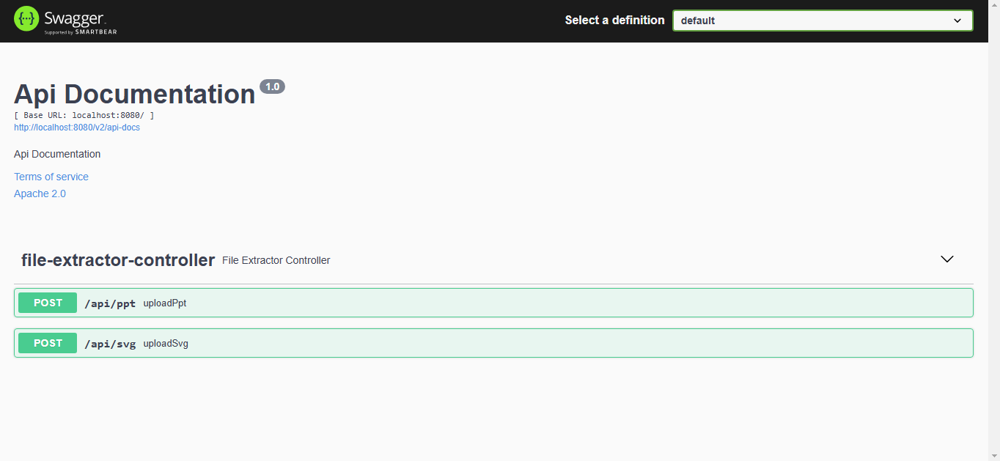

# FileDetailExtractor
API: /api/svg
This API converts an SVG file into a PNG file and extracts details such as foreign objects, links, and images present in the SVG file. The converted PNG file is saved on the server, and the extracted information is returned in the response.

API: /api/ppt
This API extracts details about the shapes present in PPT/Slide files, including shape type, text content, position, size, and custom properties. It provides a structured response with comprehensive information about each shape in the presentation.

Note: Before executing the code, please ensure a folder named **"Upload"** is created in **Local Disk C** to store the converted images.

Testing Files:
I have also uploaded the **testing file** that was used to validate the code functionality.

